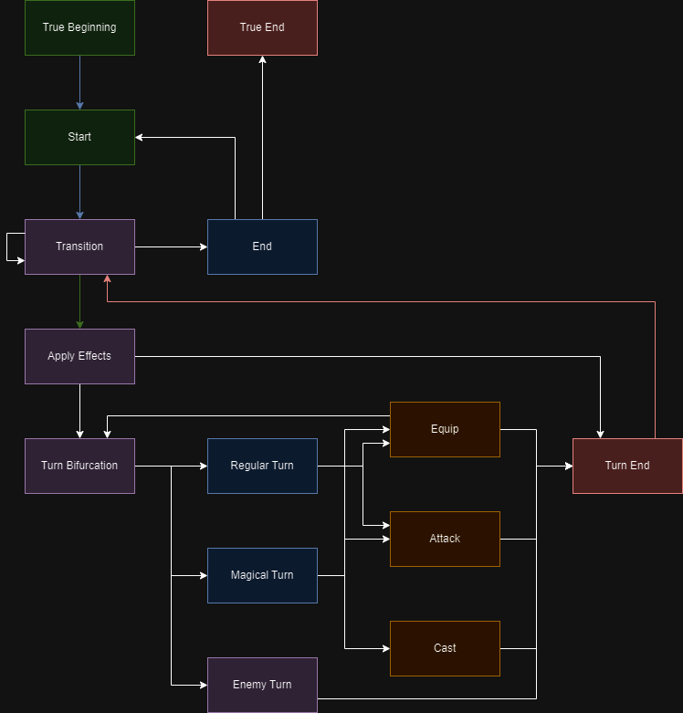

 <h1 align="center">Final Reality</h1>
 
Simplified clone of the renowned game, Final Fantasy!

### Final Reality

Final Reality is a simplified clone of the renowned game, Final Fantasy. Its main purpose is to
serve as an educational tool, teaching foundational programming concepts.

# Characteristics <!-- omit in toc -->

- [Classes and constructors](#classes-and-constructors)
    - [Entities](#entities)
    - [Characters](#characters)
    - [Weapons](#weapons)
    - [Enemies](#enemies)
    - [Teams](#teams)
    - [Turn Scheduler](#turn-scheduler)
    - [Spells](#spells)
    - [Effects](#effects)
    - [Game States](#game-states)
- [Disclaimer](#disclaimer)
    - [Constructor requirements](#constructor-requirements)
    - [Cure](#cure)
    - [Coverage](#coverage)

# Classes and constructors

Constructors within the project were made in such a way that certain specific elements are not required and can be later given
in order to overcome certain errors. For example, [weapons](#weapons).

## Entities

There's two types of entities under the IEntity interface, [characters](#characters) and [enemies](#enemies), both sharing some characteristics,
those being:

- A name.
- An amount of life points (HP).
- A defense stat.
- A weight value.

Out of these stats, they are required to have:

- HP greater than or equal to 0.
- Defense value greater than or equal to 0.
- Weight value greater than 0.

For the purpose of this game implementation, entities can both attack and defend, with the methods returning
final damage dealt for if later needed.

To increase game complexity, a state variable is added to entities. It will take on the job of handling whether the
entity can perform any sort of action.

- actionAble state variable

To prevent unwanted situations, an alive clause will be added, mainly to support on the transition between states.

>For this, even though some subclasses don't have an innate attack value, they can deal damage, meaning their
attack value is gotten from somewhere else, and it can be gotten, thus a getAttack method is only reasonable.

Entity subclasses cannot attack entities with a common root class, subclass to Entity, for this will throw an
exception via pseudo double dispatch that just serves as a bypass.

## Characters

Characters all share the common root interface ICharacter that extends IEntity, which grants all sub instances have:

- A name.
- An amount of life points (HP).
- A defense stat.
- A weight value.
- Ability to equip or un-equip weapons.

Additionally, there's magical characters who have an additional stat:

- Mana (mana points), which controls their ability to use magic and is required to be greater than or equal to 0.

At last, there's traits that define which characters can use specific [weapons](#weapons), although quite self-explanatory, as follows:

- SwordBearer
- AxeBearer
- BowBearer
- WandUser
- StaffUser
> This has now become obsolete with the implementation of double dispatch, may remove later on if no use is found.

The characters and their respective weapons are:

- Common Characters:
  - Paladin (SwordBearer, AxeBearer)
  - Warrior (SwordBearer, AxeBearer, BowBearer)
  - Ninja   (SwordBearer, BowBearer, WandUser)
- Magical Characters:
  - White Mage (WandUser, StaffUser, BowBearer)
  - Black Mage (WandUser, StaffUser, SwordBearer)

> A method for retrieving magic attack was defined in the MagicalCharacter interface, following the example getter
for attack that is innate only for enemies, this one calls upon the magic attack getter of the equipped weapon.

## Weapons

Weapons are a crucial part of the game as they can be equipped and used in combat. Their functionality is to give the [characters](#characters) the capacity to damage their opponents.
Weapons are instances of the interface IWeapon which grants all sub instances have:

- A name.
- An attack value.
- A weight value.
- An optional owner.

Out of these stats, they are required to have:

- Attack greater than 0.
- Weight value greater than or equal to 0.

Additionally, there's magical weapons who have an additional stat:

- Magic Attack, which controls their ability to use spells and is required to be greater than 0.

The weapons are:

- Common Weapons:
  - Sword
  - Axe
  - Bow
- Magical Weapons:
  - Wand
  - Staff

A weapon can be equipped by up to one character at a time. It can be exchanged during said characters turn for 
some weapon without owner, and they can be unequipped.

Weapons cannot be equipped by characters unable to use them.

When trying to assign a weapon with an owner already, an exception will be thrown.

Double dispatch implementation for weapon assignation. All [characters](#characters) call upon
equip method, which varies depending on the class that called upon it.

> The change of weapon mechanic is under revision, for it may lead to unexpected outcomes in turn taking.
> Planning on only letting weapons be replaced by certain other weapons that follow certain weight restriction
> so as not to break the game mechanics (Changing to an OP weapon after using a lighter one to take a turn sooner).

> A method for retrieving magic attack was defined in the Weapon interface, it is meant to throw an error unless
it is a magic weapon. This way we can implement [spells](#spells) that are dependent on the weapon used, giving
more game mechanics to use.

## Enemies

Enemies are character-like instances, they are what characters have to fight against in order to win a game.
Enemies are instances of the class Enemy which grants all sub instances have:

- A name.
- An amount of life points (HP).
- An attack value.
- A defense stat.
- A weight value.

Out of these stats, they are required to have:

- HP greater than or equal to 0.
- Defense greater than or equal to 0.
- Attack greater than 0.
- Weight value greater than 0.

## Teams

Both characters and Enemies are organized in teams. Each team has a specified capacity for members.
The teams are represented as ArrayBuffer instances with their maximum and minimum lengths decided upon creation.
The teams are:

- Party (Exactly 3 ICharacter instances)
- Enemies (Up to 5 IEnemy instances, at least 1)

> Yes, there's a team for enemies, this is solely for game mechanics purposes, like limiting the amount
of enemies a Party has to fight.

### Adding/Removing Members from Teams

When a new member tries to join a full team, it will throw an exception for a bad handling from the user.
Changing a member of a team is always possible.
Removing a character is achieved with the change method, passing None as the newMember parameter.
If removing the character would leave the team with less than minimum members, an exception for a bad handling from the user will be thrown.

### Knowledge of defeat

A team is required to know if it is defeated or not, the way it is implemented here is by checking if there is any alive member left on the team. 
Alive is defined as having HP greater than 0.

## Turn Scheduler

Throughout the gameplay, a main feature to expect is the assignation of turns, for which the implementation goes as follows.

- There's characters and enemies that need to take part into fighting.
- All entities need an action bar to take turns, reset upon taking turn.
- The limit for the action bar has to be calculated.
- The turn scheduler needs to be able to add and remove entities.
- All action bars should be raised when no entity can do anything.
- It should be known if an entity can do something.
- Entities ready to move should do so in order, depending on surplus (desc).
- Only one entity at a time can be taking action, it should be known which.

> Requirements not fully described, so most methods remain public for now.

> A turn scheduler will only be used for a single battle or game instance.

### Turn Taking

All entities have an action bar, and it's their time to move when it is full.
The action bar is defined as a limit, upon reaching it, the turn will be queued.
To decide the turn when many fulfill the requirements, the surplus is calculated, greater surplus takes first turn.
Upon taking a turn, the action bar resets.
When all entities are done with the turns for the round, all action bars are raised by a constant amount each time.

### Storage

Entities are stored in an ArrayBuffer, same for their action bars, which are respective in terms of index.

Adding an entity will append it to the last element of the characters ArrayBuffer, creating a new action bar starting
at zero appended to the last element of the action bars ArrayBuffer.

Removing a character works by finding the index and removing the elements there from characters array and bars array.

## Spells

For this implementation, spells are going to be a reserved ability for Magical Characters.
This means characters without mana will not be able to cast them, let alone enemies, so no need for tests there.

Attack spells will be dealt with as normal attacks, but they will have the requirement for the caster to consume mana.

The spells will only be cast if the mage casting it has enough mana, if not, exception will be raised and the spell
won't be cast at all.

Spells can be learned by any Magical Character, although only certain Mages will be able to cast certain Spells,
following the fact that useless stuff can be leaned and still be useless. :)

Spells can so far attack every entity, but will leave it as is for scalability reasons.
Spells only count half of a character's and enemy's defense (rounded up).

> Spells will be cast by some magical character, is the character the one that decides whom to cast a
spell on and which spell to cast, so restriction on targets will be handled there.
> Should the need for refactor ever arise, it will be done.

## Effects

So far, effects may only be required to be implemented on [enemies](#enemies), but for scalability they will be designed
and adapted for all [IEntity](#entities) instances.

Effects have damage and duration values associated.
Damage will be considered true damage for it will ignore all defense, said damage will be set upon casting the
[spell](#spells) that triggers it, and will be dependent on the initial damage dealt by the casting for most instances,
certain spells may have different rules, such as heal or other possible special spells.

Some spells (required) will have a dmg value relative only to casters Magic Attack (equipped [weapon's](#weapons) Magic
Attack). All of this handled in [Spell](#spells) definition.

### Considerations
Casting method may later be changed to a format in which a spell implements a function, and the cast method receives
three parameters, caster, target and spell.
On the other hand, the spell itself could become the spell handler, so the cast method is within it, and it receives 
the caster and target, which could open the possibilities for pattern design implementations.

I like the second idea better.

Second one implemented with certain modifications.

It's been made so that the Magical Character is still the caster, passing down information to the spell,
all effects handled within spell, taking into consideration both caster and target.

# Game controller

A game controller was implemented, its main function is to hold and provide an [input handler](#input-handler) and turn scheduler to its
[game state](#game-states) to ensure proper functioning.

# Input Handler

A class to handle certain types of input, from console or a forced input for example.

# Game States

## Game State Flow Diagram

### Disclaimers

- [Equip](#equip-within-turn-loop)
- [Enemy Turn](#single-state-enemy-turn)
- [Apply Effects](#apply-effects-to-turn-end)

## Flow Mechanics

For this implementation of the game, there will be many States in which the Player will have no decision power, and flow
will be automatic.

### Stand By State

There are States that require the Player to decide many things, including when to leave the State and transition to the
next.

### Automatic State

There are some States that will make decisions automatically and may notify the player of the events happening. The
Player can do nothing but wait for a Game State that allows for Player Interactions.

### Automatic Flow

These are transitions between States that are triggered automatically if conditions are met.

### Decision States

These are States that will require the Player to make decisions regarding game flow.

### Decision Flow

These are transitions that require interactions of the Player to be made.

### Interaction States

These are States that will trigger interactions between game components, such as Character equipping a Weapon, An entity
attacking a foe or a Character healing an ally. Some may be automatic, others may require a certain level of Player
interactions.

### End Phase State

These are a kind of [Automatic State](#automatic-state) that marks the end of a particular branch of the game flow,
such as end of a level, end of a turn and others to add should there be a necessity.
These States may potentially be able to modify the [Game Controller](#game-controller) elements (Besides
[State](#game-states)), such as eliminating entities from the [Turn Scheduler](#turn-scheduler).

## Specifics

There's two states that do not loop over, true beginning and true end.

As for the other states, they all can be reached from another game state and will eventually modify the game state to
maintain game flow.

While the game flow is pretty straightforward, there may be some un-intuitive things mentioned bellow.

### Equip within Turn Loop

This state is able to end a turn when the equipped weapon is heavier than the old one in order to not break game flow
or generate weird behaviors.

### Single State Enemy Turn

Enemy turn state handles everything an enemy does within a single state, for it is all automatic anyway.

### Apply Effects to Turn End

This is pretty obvious, if an entity dies when applying its effects, then nothing can be done.

# Disclaimer

## Constructor requirements

For the creation of the constructors, require methods of the exceptions package were used without directly setting the
values, they are used only for checking valid values for stats as if they were returning a Unit type value.

This will be changed when enough information on the mechanics of the game is disclosed, which will be linked to deletion of
some constraining methods previously defined (if any).

## Cure

In future implementations, enemies could also be able to be cured by themselves under specific conditions, so cure method
will be an HP modifier method defined in IEntities.

## Coverage

For the version of Scala I'm using, it now has a branch coverage that I cannot go around.
Also, I'd like to know what tests are missing for Require in exceptions, it's quite annoying.

## States

Game States so far are a simplified version of the diagram, many are yet to be implemented.
Thinking on adding a game menu State (like Pause) as a special State, capable of saving previous State
and having the option of going back to the previous state or exiting.

Main loop may be changed to a loop instead of recursion.

# Old Origin

origin  https://github.com/dcc-cc3002/final-reality-Ateuluz.git (fetch)

origin  https://github.com/dcc-cc3002/final-reality-Ateuluz.git (push)

# License

This project is licensed under the
[Creative Commons Attribution 4.0 International License](https://creativecommons.org/licenses/by/4.0/).